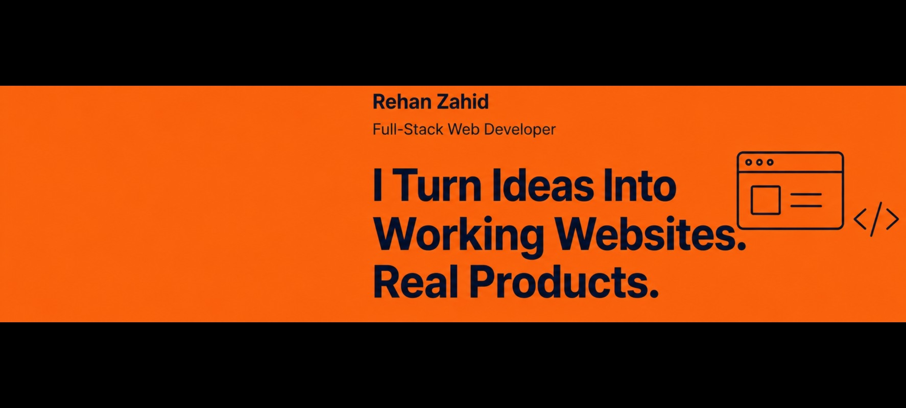

 

  
  
  
  

---

### 👋 About Me

Most junior profiles ask you to trust a resume — mine gives you a live product to click and a GitHub full of source code to read.

I'm **Rehan Zahid**, a full-stack web developer based in Islamabad, Pakistan. I studied Computer Science (ICS) and then specialized in web development through **Bano Qabil's** program — so what's in my repos isn't tutorial-copied, it's built on fundamentals. Right now I'm freelancing and looking for an **internship or junior developer seat in Islamabad**, where the codebase and the stakes are real.

> 💬 If you've got a project worth discussing, send it over — I'd rather talk about real code than exchange generic messages.

---

### 🚀 What I'm Building

**[FreeToolsHub](https://rehankhanzahid789.github.io/FreeToolsHub/)** — a free utility tools website, live and hosted right now, built solo with vanilla HTML, CSS, and JavaScript (no frameworks).

| | |
|---|---|
| **Status** | Live, hosted on GitHub Pages, running ads (Adsterra) |
| **Tools shipped** | 35+ and growing — calculators (Age, BMI, Loan/EMI, Tip, Percentage, Discount), generators (QR, Password, UUID, Lorem Ipsum, Invoice), converters (Unit, Timezone, CSV→JSON, Base64), dev tools (JSON Formatter, Regex Tester, JWT Decoder, Hash Generator), and design tools (Color Picker, CSS Gradient/Box-Shadow Generator) — [see the full list →](https://rehankhanzahid789.github.io/FreeToolsHub/) |
| **Architecture** | `js/tools.json` drives dynamic card rendering; each tool is a self-contained folder — adding a new tool takes one folder + one JSON entry |
| **Notable fix** | Solved an Adsterra `atOptions` global-variable collision by isolating each ad slot in its own `<iframe srcdoc>` |

Beyond that, my GitHub has full-stack **PHP/MySQL** projects built end-to-end, backend included:

- **[Bite-Rush](https://github.com/rehankhanzahid789/Bite-Rush)** — restaurant ordering system built to feel like a real food-delivery platform
- **[Sky-Cast](https://github.com/rehankhanzahid789/Sky-Cast)** — full-stack weather app
- **[Task-Flow](https://github.com/rehankhanzahid789/Task-Flow)** — SaaS-style task manager with drag-and-drop boards, multi-workspace support, and a stats dashboard
- **[Talk-Nest](https://github.com/rehankhanzahid789/Talk-Nest)** — real-time-style 1-to-1 chat app using AJAX polling, no WebSockets
- **[Mind-Metric](https://github.com/rehankhanzahid789/Mind-Metric)** — IQ/aptitude testing platform with timed assessments, category scoring, and analytics dashboard
- **[Horizon-Prime](https://github.com/rehankhanzahid789/Horizon-Prime)** — luxury real estate platform with property listings, agent management, and an admin panel
- **[Velora](https://github.com/rehankhanzahid789/Velora)** — dark, editorial-style blogging platform (vanilla PHP + MySQL, no frameworks)
- **[Brew-Map](https://github.com/rehankhanzahid789/Brew-Map)** — cafe discovery platform pulling live data from OpenStreetMap's Overpass API
- **[LMS](https://github.com/rehankhanzahid789/LMS)** — Learning Management System with admin panel, courses, faculty, and student management
- **[TheMotorCrew](https://github.com/rehankhanzahid789/TheMotorCrew)** — vehicle information management showcase site

---

### 🛠️ Tech Stack

  
  
  
  
  
  
  

**Languages spoken:** Urdu (Full Professional) · English (Professional Working) · Pashto (Native/Bilingual) · Arabic (Elementary)

---

### 📊 GitHub Stats

  
  

  

---

### 🎓 Education

- **Bano Qabil IT Courses** — Web Development, Computer Science *(Feb 2026 – Jun 2026)*
- **IMCB G-10/4** — ICS, Computer Science *(Aug 2023 – Jun 2025)*
- **Channab College F-8/4** — Matric, Computer Science *(Aug 2022 – Aug 2023)*

---

### 🤝 Let's Connect

I'm open to:

- **Freelance web development projects**
- **Internship / junior developer roles** in Islamabad
- Feedback on my code — send me a project and I'll tell you what I'd have built differently

📩 **rehankhanzahid789@gmail.com**

 
Last updated: July 2026

